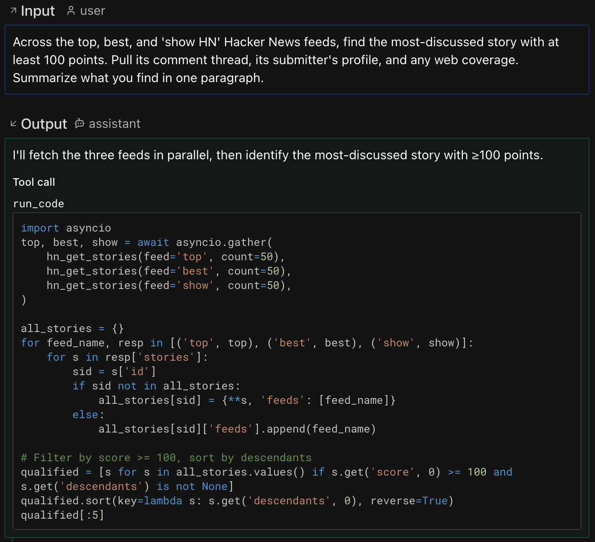

# Code Mode

Replace individual tool calls with a single sandboxed Python execution environment.

[Source](https://github.com/pydantic/pydantic-ai-harness/tree/main/pydantic_ai_harness/code_mode/)

## The problem

Standard tool calling often needs another model turn for each dependent batch of tool calls. An agent
that needs to fetch 10 items and then process their results can require many model turns, increasing
latency, cost, and context use.

## The solution

`CodeMode` wraps eligible tools into a single `run_code` tool. The model writes orchestration code
with loops, conditionals, variables, and `asyncio.gather` inside a sandboxed
[Monty](https://github.com/pydantic/monty) runtime. Calls from that code are dispatched through
Pydantic AI to the host tools.

| Standard tool calling | Code mode |
|---|---|
| Dependent tool batches across model turns | Many dependent calls in one `run_code` |
| Parallel only when the model emits a batch | Parallelism expressed in Python |
| No local computation | Filter, transform, aggregate in code |
| Large conversation history | Compact -- fewer messages |

Durable execution integrations can record nested calls for deterministic replay.

## Usage

```python
from pydantic_ai import Agent
from pydantic_ai_harness import CodeMode

agent = Agent('anthropic:claude-sonnet-4-6', capabilities=[CodeMode()])

@agent.tool_plain
def get_weather(city: str) -> dict:
    """Get current weather for a city."""
    return {'city': city, 'temp_f': 72, 'condition': 'sunny'}

result = agent.run_sync("What's the weather in Paris and Tokyo, in Celsius?")
print(result.output)
```

The model writes code like:

```python
import asyncio

paris, tokyo = await asyncio.gather(
    get_weather(city='Paris'),
    get_weather(city='Tokyo'),
)
paris_c = round((paris['temp_f'] - 32) * 5 / 9, 1)
tokyo_c = round((tokyo['temp_f'] - 32) * 5 / 9, 1)
{'paris': paris_c, 'tokyo': tokyo_c}
```

## In practice

The [harness Quick start](../../README.md#quick-start) wires `CodeMode` up against an MCP server and a web search and asks it to find the most-discussed Hacker News story across three feeds, pull the comment thread and the submitter's profile, and search the web for follow-up coverage. CodeMode collapses that into two `run_code` calls: the first fetches all three feeds in parallel via `asyncio.gather`, dedupes by id, filters by score, and ranks by comment count -- in plain Python; the second batches the three follow-up calls (`hn_get_thread`, `hn_get_user`, `duckduckgo_search`) together.

[](https://logfire-us.pydantic.dev/public-trace/84bcf123-2106-49da-9f6f-5c26395339bb?spanId=7650806a0785b946)

**[See the full Logfire trace ->](https://logfire-us.pydantic.dev/public-trace/84bcf123-2106-49da-9f6f-5c26395339bb?spanId=7650806a0785b946)** Each `run_code` span fans out into the tool calls the model issued from inside the sandbox -- the easiest way to understand what code mode actually did. See the [Pydantic AI Logfire docs](https://ai.pydantic.dev/logfire/) for setup details.

## Installation

Code mode requires the Monty sandbox:

```bash
uv add "pydantic-ai-harness[codemode]"
```

The `code-mode` extra is also supported as an alias.

## Selective tool sandboxing

By default, `CodeMode(tools='all')` sandboxes every eligible regular tool. Framework control tools,
undiscovered deferred tools, native fallbacks, and other code-execution tools remain native. Shell
surfaces count as code-execution tools: `Shell`'s `run_command` and `start_command`, and
`ModalSandbox`'s `run_command`, sit beside `run_code` rather than inside it, so the model never has
to quote a shell command inside a generated Python string. `CapabilityCreation`'s
`author_capability` stays native for the same reason: its argument is a complete Python module.
Their non-command tools (`read_file`, `check_command`, and so on) are folded into `run_code` like
any other tool. You can control which eligible tools go through the sandbox:

```python
from pydantic_ai_harness import CodeMode

# By name -- only these tools are available inside run_code
CodeMode(tools=['search', 'fetch'])

# By predicate
CodeMode(tools=lambda ctx, td: td.name != 'dangerous_tool')

# By metadata -- combine with SetToolMetadata or .with_metadata()
CodeMode(tools={'code_mode': True})
```

Tools that match the selector are wrapped inside `run_code`. Non-matching tools remain available as regular tool calls.

### Tool Search

When you mark tools or whole toolsets `defer_loading=True` ([Tool Search](https://ai.pydantic.dev/tools-advanced/#tool-search)), `CodeMode` keeps them out of `run_code` while they're undiscovered -- they pass straight through, so Tool Search drives them as usual (sent on the wire with `defer_loading` on providers with native tool search; otherwise dropped until discovered, with a `search_tools` tool alongside `run_code`). `CodeMode` uses `RunContext.is_tool_available` to follow that reveal state. Once the model discovers a tool -- or loads the deferred capability that owns it -- `CodeMode` folds it into `run_code` like any other tool from then on, so it's callable from generated code. (The tool keeps `defer_loading=True`, which records what its author asked for; what changes is its availability for the run.)

That fold-in grows `run_code`'s description, which invalidates the prompt-cache prefix once at the moment of discovery (turns with no discovery stay cache-warm). Two ways to avoid the bust:

- Pass `dynamic_catalog=True` to keep `run_code.description` static across discoveries -- the catalog of sandboxed-tool signatures moves into agent instructions (as a dynamic [`InstructionPart`](https://ai.pydantic.dev/api/messages/#pydantic_ai.messages.InstructionPart)) and newly-discovered tools are announced via [`ctx.enqueue`](https://ai.pydantic.dev/api/tools/#pydantic_ai.tools.RunContext.enqueue) instead of by rebuilding the description:

```python
from pydantic_ai_harness import CodeMode

CodeMode(dynamic_catalog=True)
```

  This pays off when paired with Tool Search: the tool-definitions block stays byte-stable so the prefix cache survives discoveries, at the cost of a larger (but cache-friendly) system prompt. With a fixed toolset and no Tool Search, the default keeps the system prompt shorter and is the better choice.

- To instead keep a Tool Search corpus fully native -- never folded into `run_code`, but not callable from inside it -- exclude it with a `tools` selector; corpus members carry `with_native` set to the managing native tool:

```python
from pydantic_ai_harness import CodeMode

CodeMode(tools=lambda ctx, td: td.with_native is None)
```


### Metadata-based selection

Use metadata when the decision should travel with a tool or toolset, rather than
with one `CodeMode` instance. This is useful for shared toolsets: the toolset
author can tag the tools that are safe and useful to call from generated code,
and each agent can opt into that tag with `CodeMode(tools={...})`.

`CodeMode(tools={'code_mode': True})` uses the standard Pydantic AI
`ToolSelector` metadata form. A tool is sandboxed when its
`ToolDefinition.metadata` contains all of the selector's key-value pairs. Extra
metadata on the tool is fine, and nested dictionaries are matched by deep
inclusion.

The common pattern is to tag an entire toolset with `.with_metadata(...)`:

```python
from pydantic_ai import Agent
from pydantic_ai.toolsets import FunctionToolset
from pydantic_ai_harness import CodeMode


def search(query: str) -> str:
    """Search the web."""
    return f'results for {query}'


def fetch(url: str) -> str:
    """Fetch a URL."""
    return f'contents of {url}'


search_tools = FunctionToolset(tools=[search, fetch]).with_metadata(code_mode=True)

agent = Agent(
    'anthropic:claude-sonnet-4-6',
    toolsets=[search_tools],
    capabilities=[CodeMode(tools={'code_mode': True})],
)
```

Here `search` and `fetch` are removed from the model-facing tool list and
become callable functions inside `run_code`. Tools without
`metadata['code_mode'] == True` stay visible as regular tool calls.

## Return values

The last expression in the code snippet is automatically captured as the return value -- the model does not need to `print()`. An assignment stores a value in the REPL but does not return it. A final expression that evaluates to `None` is also treated as no result. Without a non-`None` final expression or print output, `run_code` returns `{}`. Put the assigned name on the final line:

```python
result = await get_weather(city='Paris')
result
```

| Scenario | Return |
|---|---|
| Non-`None` final expression with no print output | Last expression value |
| Final assignment or `None` result with no print output | `{}` |
| Print output with no final expression or a `None` result | `{"output": "<printed text>"}` |
| Print output with a plain, non-`None` final expression | `{"output": "<printed text>", "result": <last expression>}` |
| Multimodal final expression with no print output | Returned natively for model processing |
| Print output with a multimodal final expression | List with printed text followed by native multimodal content |

Printed output is limited to 10 MiB. Exceeding the limit makes `run_code` return a model retry.

Sandbox execution is bounded by `resource_limits`, which defaults to 30 seconds of execution time
and a 256 MiB heap. What this guarantees is a per-snippet ceiling: no single `run_code` snippet runs
longer than `max_duration_secs` of sandbox time, which is what stops a runaway loop. Time spent
awaiting a nested tool is excluded from that timer.

It is not a run-wide CPU budget, and it cannot be relied on as one. Monty applies the limits per
sandbox session, so consecutive `run_code` calls draw down one shared allowance and each new session
starts with a full one. Sessions are replaced by `restart: true` and by the failures that reset the
REPL: a worker crash, a type error, a host-side failure, and a syntax error before any code has run.
Each of those renews the allowance without the model asking for a restart. An ordinary exception
inside a snippet is not one of them.

Once a session's allowance is spent, every later `run_code` call fails on arrival, including
snippets that would cost almost nothing, because they reuse the same session. Rewriting the code
does not help. `restart: true` is what recovers it, at the cost of the REPL state that session was
holding, so any variables, imports, and definitions have to be recreated. `run_code` says as much
in the retry it returns, and that retry also reports the nested calls the snippet already made, so
restarting does not throw away the only record of them. The behaviour is worth knowing when
choosing `max_duration_secs`: set it low and a long agent run will spend it on ordinary work and
pay a restart to continue.

Nested tool calls are bounded separately by `max_tool_calls`, which defaults to 100 per `run_code`
call. The budget is reserved before each call is scheduled, so a snippet cannot dispatch more work
than it allows. A call past the budget fails at its call site inside the sandbox. A snippet that
catches the error keeps the results of the calls that already completed and can return them. A
snippet that lets it propagate gets a model retry reporting how many nested calls started,
followed by per-call detail: what each was called with, and whether it returned, raised, or was
denied. Calls that raised are included rather than filtered out, since a tool can apply a change
before failing. That detail is bounded -- arguments and results are previewed, and the list stops
at a size cap and says how many entries it left out -- so a large payload cannot inflate the
retry. The reported total stays exact whether or not the list was cut, which is what tells the
model some calls are missing from what it can see. The list is context for the model, not a guard:
nothing stops it from calling those tools again, so treat it as informing the next attempt rather
than preventing a repeat.

Override them with `resource_limits={'max_duration_secs': 10, 'max_memory': 134_217_728}` and
`max_tool_calls=25`. Pass `resource_limits='unlimited'` only when another execution boundary
supplies equivalent limits.

When `CodeMode` runs inside a Temporal workflow, it disables `max_duration_secs`, including an
explicit override. `run_code` is replayed in workflow code, so measuring elapsed time there could
make replay choose a different path from the recorded workflow. The memory cap still applies. Put
time-bounded work behind a Temporal activity instead.

## REPL state

State persists between `run_code` calls within the same agent run -- variables, imports, and function definitions carry over. Pass `restart: true` in the tool call to reset state. If a worker crash or host-side execution failure invalidates the session, `run_code` returns a model retry that reports the reset; the next snippet must recreate any required state.

## Temporal durability

Install both integrations:

```bash
uv add "pydantic-ai-harness[codemode,temporal]"
```

Construct the named agent and its stable-ID toolsets outside the workflow, then attach
`TemporalDurability` alongside `CodeMode`:

```python
from pydantic_ai import Agent
from pydantic_ai.durable_exec.temporal import TemporalDurability
from pydantic_ai_harness import CodeMode

agent = Agent(
    'openai:gpt-5.6-sol',
    name='coding-agent',
    capabilities=[CodeMode(), TemporalDurability()],
)
```

Follow the [Pydantic AI Temporal guide](https://pydantic.dev/docs/ai/capabilities/durable_execution/temporal/)
to call the plain agent from a workflow and register its activities with `PydanticAIPlugin` and
either `__pydantic_ai_agents__` or `AgentPlugin`.

`PydanticAIPlugin` passes `pydantic_monty` through Temporal's workflow sandbox. This makes Monty
runnable there, but `run_code` still executes in workflow code and is re-executed during replay.
Model requests and, by default, nested tool calls cross Temporal activity boundaries;
`asyncio.gather` can schedule nested tool activities concurrently. The REPL is process-local state
for one agent run, not durable storage. Replay reconstructs it by running the recorded snippets
again against recorded activity results.

Keep workflow-side code deterministic. `mount` reads and writes, `os_access` callbacks, and
host-clock calls happen again during replay; changing their results can change which activities the
workflow schedules and cause a `NondeterminismError`. Put external reads, writes, clock access, and
other side effects in wrapped tools so Temporal records them as activities. Replay may not flag
changed arguments when the same activity remains at the same history position, so replay validation
is not a substitute for this boundary. Temporal activity timeouts apply to nested tools, not pure
computation inside `run_code`; move time-bounded computation behind an activity.

## Observability

Nested tool calls inside `run_code` produce their own spans when instrumented with [Logfire](https://pydantic.dev/logfire) or any OpenTelemetry backend. The `run_code` tool return includes metadata with all nested calls:

```python
from pydantic_ai import Agent
from pydantic_ai.messages import ToolReturnPart
from pydantic_ai_harness import CodeMode

agent = Agent('anthropic:claude-sonnet-4-6', capabilities=[CodeMode()])


@agent.tool_plain
def get_weather(city: str) -> dict:
    """Get current weather for a city."""
    return {'city': city, 'temp_f': 72}


result = agent.run_sync("What's the weather in Paris?")

for msg in result.all_messages():
    for part in msg.parts:
        if isinstance(part, ToolReturnPart) and part.tool_name == 'run_code':
            metadata = part.metadata or {}
            tool_calls = metadata['tool_calls']      # dict[str, ToolCallPart]
            tool_returns = metadata['tool_returns']  # dict[str, ToolReturnPart]
```

## Filesystem and OS access

Sandboxed code starts with no access to the host's files, environment, or clock. Two parameters add
controlled filesystem, environment, or clock behavior.

**`mount` -- share host directories.** Reach for this when the agent works with real files: analyzing
a dataset you've dropped in a folder and writing a report back, editing a checkout, or processing a
batch of documents. Sandboxed `pathlib` code reads and writes under the mounted path. (For
environment variables or the clock, use `os_access` instead.)

```python
from pydantic_monty import MountDir

from pydantic_ai_harness import CodeMode

# The agent can read /work/data.csv and write /work/summary.md back to the host:
CodeMode(mount=MountDir(virtual_path='/work', host_path='/tmp/agent-workspace', mode='read-write'))
```

**`os_access` -- answer the sandbox's OS calls yourself.** Reach for this when the agent needs
environment variables, the current date and time, or filesystem behavior you control. Hand it a
ready-made OS implementation, or a callback that decides each call -- so you can inject just the
secrets it needs, pin "now" for reproducible runs, or route file access to your own store.

```python
from pydantic_monty import NOT_HANDLED, OSAccess

from pydantic_ai_harness import CodeMode

# Give the agent a fixed set of environment values:
CodeMode(os_access=OSAccess(environ={'API_BASE': 'https://api.example.com'}))


# ...or intercept each call to decide what the agent may see:
allowed_env = {'API_KEY': 'sk-...'}


def my_os(fn, args, kwargs):
    if fn == 'os.getenv':
        # Answer the call: allow-listed keys resolve, every other key reads back
        # as None -- absent, exactly like a real unset variable.
        return allowed_env.get(args[0])
    # Refuse everything else: NOT_HANDLED makes the call fail in the sandbox.
    return NOT_HANDLED


CodeMode(os_access=my_os)
```

Your callback's return value decides the call's fate, and the two outcomes are easy to confuse:

- **Return any value** -- including `None`, `''`, or `0` -- and that becomes the result the sandbox
  sees. `os.getenv` returning `None` looks exactly like a normal unset variable, so the agent's code
  keeps running. This is how you *hide* something: answer with an empty value.
- **Return `NOT_HANDLED`** and the call is treated as unsupported: it raises inside the sandbox and
  the model gets a retry. This *refuses* a capability outright -- use it to block, not to say "no
  value". Returning `NOT_HANDLED` for a key the agent reasonably expects will burn retries.

`mount` exposes the selected host directories. The built-in `OSAccess` uses an isolated in-memory
filesystem and environment but the host clock by default; a custom handler or `CallbackFile` can
expose other host resources. Access is fixed when the capability is built, so construct `CodeMode`
per request to scope it.

A `MountDir` defaults to copy-on-write `mode='overlay'`: the sandbox reads host files and sees writes
made during the current `run_code` call, but Monty discards those writes before the next call and they
do **not** reach the host. Pass `mode='read-write'` when later calls need to read the writes, or
`mode='read-only'` to forbid writes.

> Monty-specific: these parameters use Monty's `AbstractOS`/`MountDir` types.

## Sandbox restrictions

Code runs inside [Monty](https://github.com/pydantic/monty), a sandboxed Python subset. Key restrictions:

- No third-party imports (allowed stdlib: `sys`, `typing`, `asyncio`, `math`, `json`, `re`,
  `unicodedata`, `datetime`, `os`, `pathlib`)
- `asyncio.gather(...)` accepts positional awaitables but no keyword arguments; other task creation
  and wait APIs are unavailable
- No wall-clock or timing primitives by default (`asyncio.sleep`, `datetime.datetime.now()`, `datetime.date.today()`, `time`) -- `datetime.datetime.now()`/`datetime.date.today()` become available when an `os_access` handler implements them (the built-in `OSAccess` does); `asyncio.sleep`/`time` never do
- No `import *`
- Filesystem I/O needs an `os_access` handler or a `mount`; `os.getenv`/`os.environ` need an `os_access` handler
- Tools requiring approval or with deferred (`CallDeferred`) execution are sandboxed like any other tool; without a `HandleDeferredToolCalls` (or equivalent) capability on the agent to resolve them inline, calling one from `run_code` raises an error that surfaces to the model as a retry

## API

```python
from pydantic_ai_harness import CodeMode

CodeMode(
    tools='all',          # 'all', list[str], callable, or metadata dict
    max_retries=3,        # retries on sandbox execution errors
    max_tool_calls=100,   # nested tool calls allowed in one run_code call
    id=None,              # required when defer_loading=True
    description=None,     # one-line catalog entry shown while deferred
    defer_loading=False,
    os_access=None,       # OS behavior; custom handlers may expose host resources
    mount=None,           # host directories to share with the sandbox
    resource_limits=None, # sandbox time and memory caps; 'unlimited' removes them
    dynamic_catalog=False,
)
```

## Agent spec (YAML/JSON)

CodeMode works with Pydantic AI's [agent spec](https://ai.pydantic.dev/agent-spec/) feature for defining agents in YAML:

```yaml
# agent.yaml
model: anthropic:claude-sonnet-4-6
capabilities:
  - CodeMode: {}
```

```python
from pydantic_ai import Agent
from pydantic_ai_harness import CodeMode

agent = Agent.from_file('agent.yaml', custom_capability_types=[CodeMode])
result = agent.run_sync('...')
print(result.output)
```

Pass `custom_capability_types` so the spec loader knows how to instantiate `CodeMode`. You can also pass arguments in the YAML:

```yaml
capabilities:
  - CodeMode:
      tools: ['search', 'fetch']
      max_retries: 5
```

## Further reading

- [Tool use via code](https://www.anthropic.com/engineering/code-execution-with-mcp) (Anthropic)
- [Code mode in production](https://blog.cloudflare.com/code-mode/) (Cloudflare)
- [Pydantic AI capabilities](https://ai.pydantic.dev/capabilities/)
